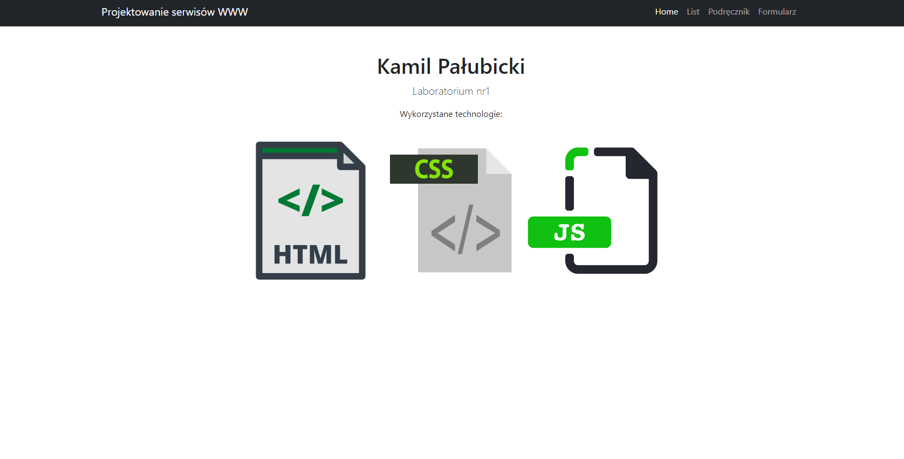
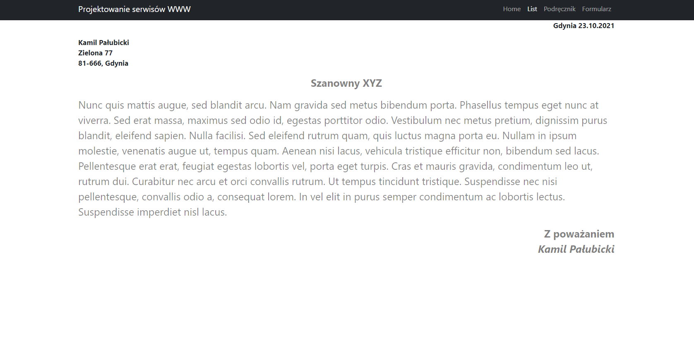
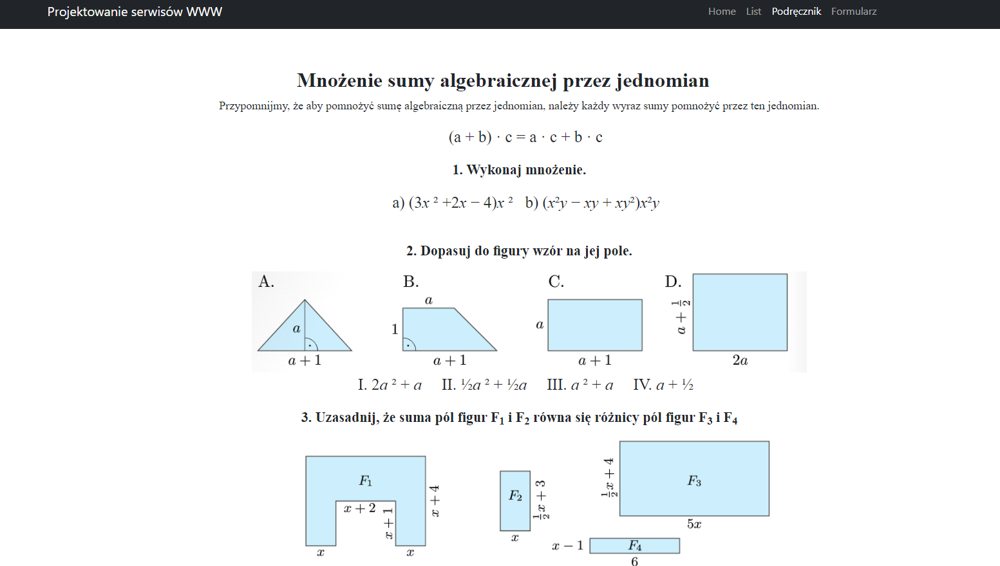
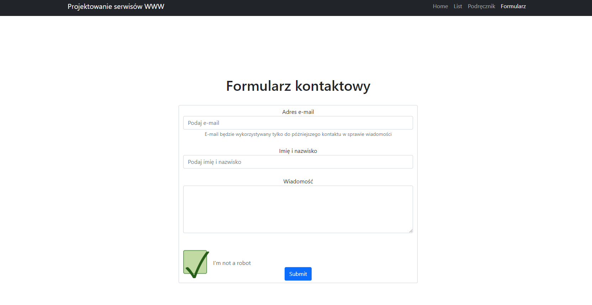

# Lab1

Aby sprawdzić działanie strony wejdź [tutaj](https://kamilpalubicki.github.io/index.html) :fire:

Plik index.html zawiera stronę główną z odnośnikami (w prawym rogu) do przekierowania 
na konkretną podstronę 

Plik list.html to podstrona z przykładowym listem 

Plik podrecznik.html to podstrona z podręcznikiem 

Plik formularz.html to podstrona z formularzem 

# index.html

Na stronie głównej możemy zobaczyć informacje o autorze, numerze laboratorium oraz o wykorzystanych technologiach 

# list.html

Strona z przykładowym listem, którego treść została wygenerowana, a sam list został odpowiednio sforamtowany.

# podrecznik.html

Strona z przykładową stroną z podręcznika od matematyki.

# formularz.html

Strona z przykładowym formularzem kontaktowym wraz z fake captcha do sprawdzania czy użytkownik nie jest robotem
