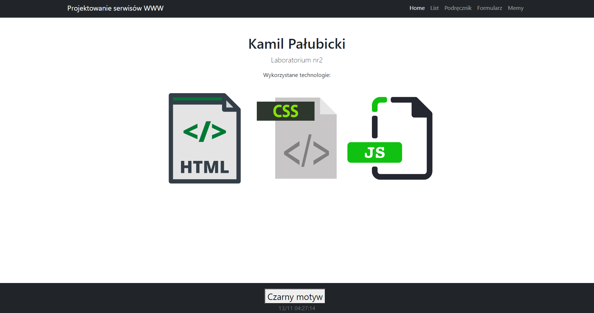
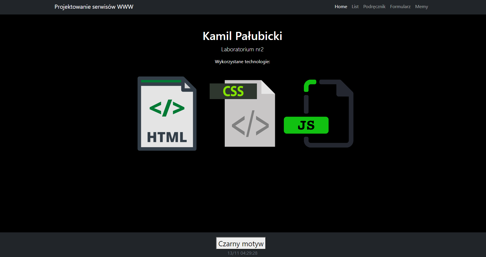
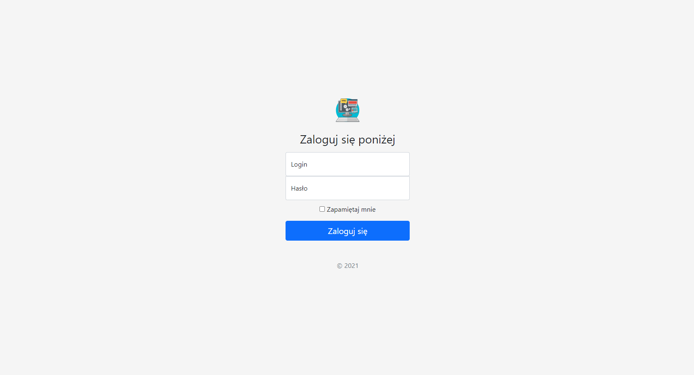
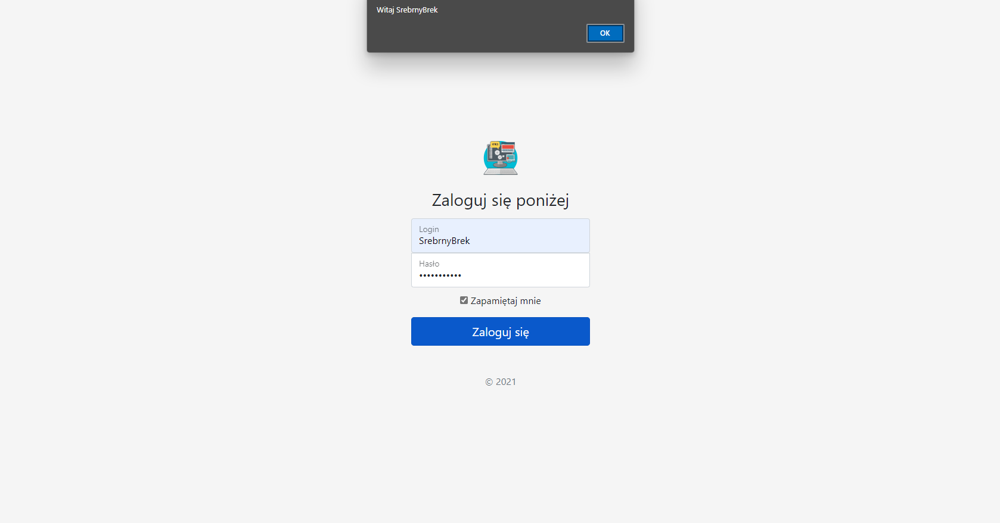
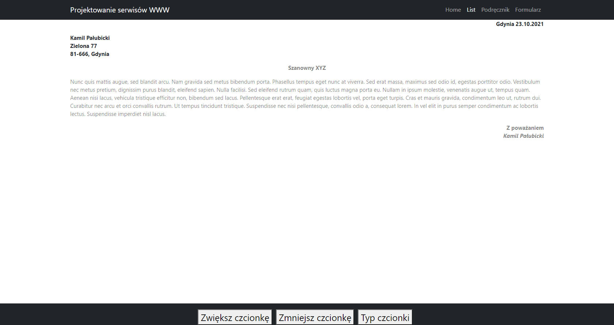
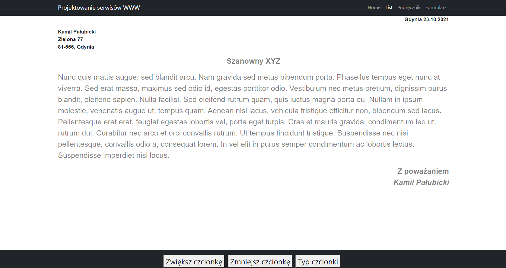
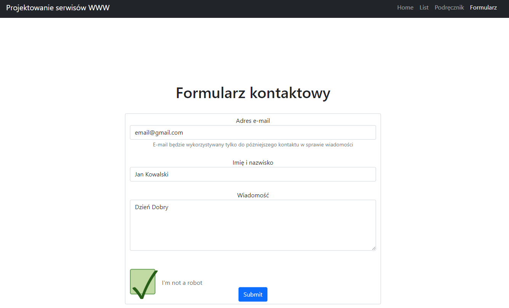
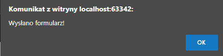
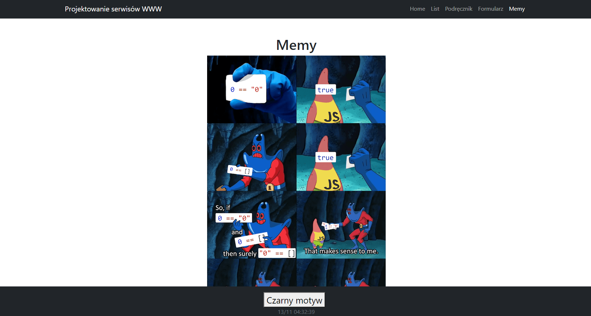
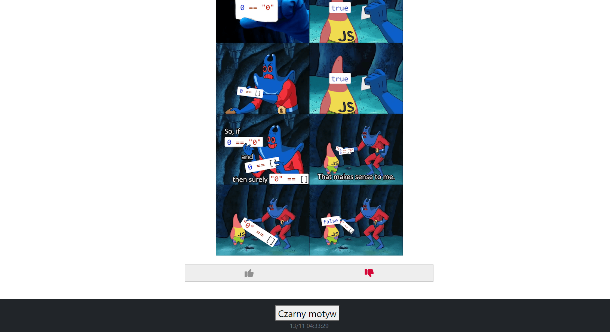

# Lab2

# index.html

Na stronie głównej możemy teraz zobaczyć dodatkową stopkę z podaną aktualną datą i godzina aktualizowaną co 1 sekunde. 

Dostępny jest również czarny motyw strony: 

W prawym górnym rogu pojawiła się opcja zaloguj się która nas przenosi do podstrony logowania: 

Po uzupełnieniu danych i kliknięciu przycisku pojawia się alert powitalny 

# list.html

Strona z przykładowym listem teraz zawiera opcje zmiany czcionki: 

Po zmianie czcionki na mniejszą:

 Po zmianie rodzaju czcionki : 

# formularz.html

Strona z przykładowym formularzem kontaktowym teraz posiada alert o wysłaniu formularza 

 Wysłanie formularza: 

# memy.html

Powstała także podstrona zawierająca memy (na ten moment 1), możemy ją przeglądać również w ciemnym motywie 

 Jest też możliwosć ocenienia "łapką w górę" lub "w dół" ukazanego mema 

