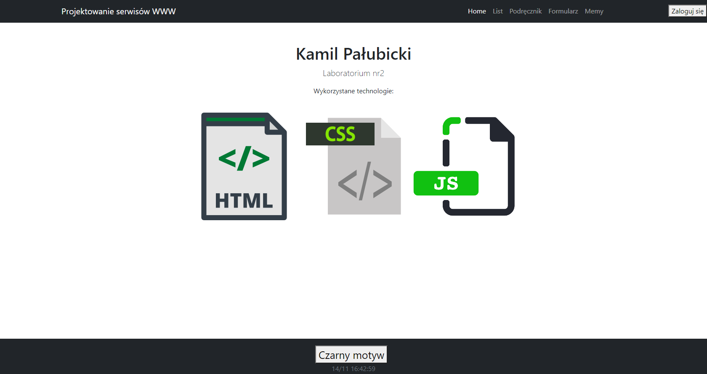

# Lab2

# index.html

Na stronie głównej możemy teraz zobaczyć dodatkową stopkę z podaną aktualną datą i godzina aktualizowaną co 1 sekunde. 

# list.html

Strona z przykładowym listem teraz zawiera opcje zmiany czcionki: 

Po zmianie czcionki na mniejszą:

 Po zmianie rodzaju czcionki : 

# formularz.html

Strona z przykładowym formularzem kontaktowym teraz posiada alert o wysłaniu formularza 

 Wysłanie formularza: 

