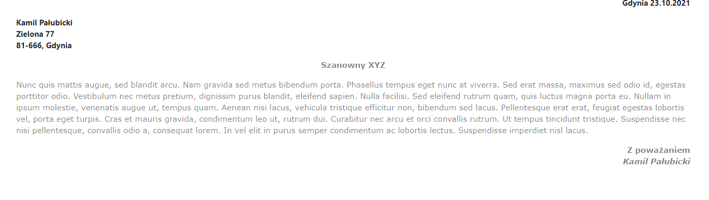
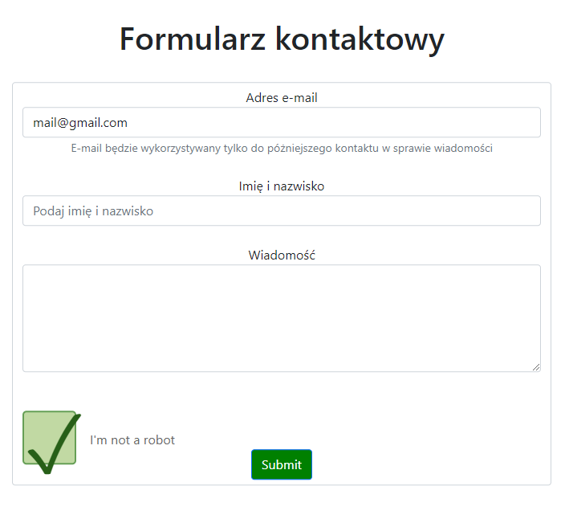

# Lab3

# index.html

Na stronie głównej możemy po "przejechaniu" myszką zobaczyć powiększające się obrazki 
przedstawiające użyte technologie, działa poprzez addEventListener("mouseover", zoomOver) i
addEventListener("mouseout", zoomOut) 

 

 

Po przytrzymaniu PPM na napisie "Laboratorium nr3" zmieniany jest kolor tekstu na losowy
addEventListener("mousedown", changecolor), addEventListener("mouseup", revertcolor) 

 

# list.html

Teraz, aby zmienić czcionkę listu wystarczy nacisnąć dwa razy na tekst (addEventListener("dblclick", randfont)) : 

 
 
 

# formularz.html

Po wpisaniu danych w formularz przycisk zmienia kolor z niebieskiego na czerwony (addEventListener("change", resetCaptcha)): 

 

Następnie po wypełnieniu captch'y submit zmienia kolor na zielony (addEventListener("click", authorize)) 

 

# memy.html

Na podstronie 'Memy' każdy ruch myszką powoduje zmianę koloru tła losowo (addEventListener("mousemove", discoColors)), natomiast po 
kliknięciu na mem (addEventListener("click", turnOffDisco)) możemy zatrzymać tą ciągłą zmianę kolorów (removeEventListener("mousemove", discoColors))  

 

# all

Dodatkowo na każdej podstronie po skierowaniu myszki z banera na inne elementy zmienia się losowo kolor tego banera  

 