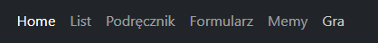
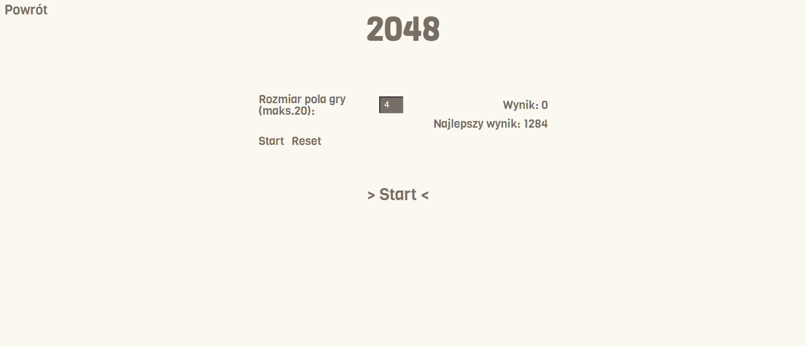
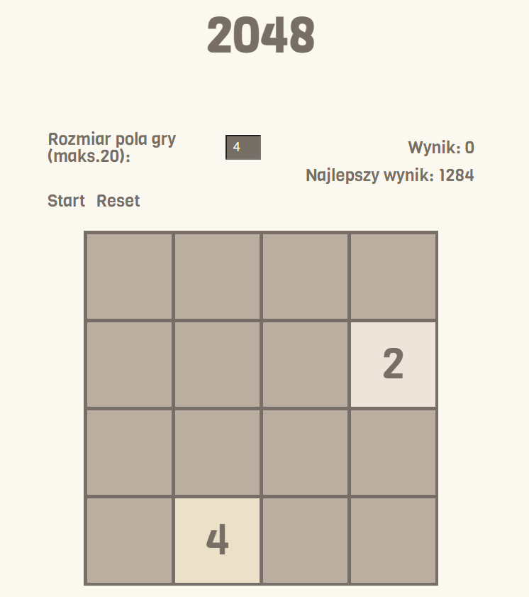
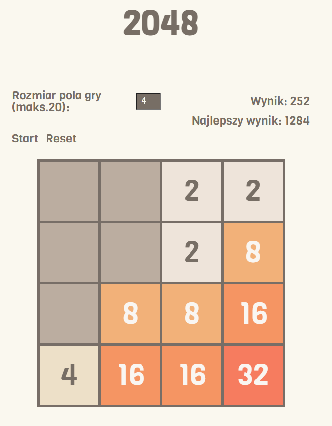
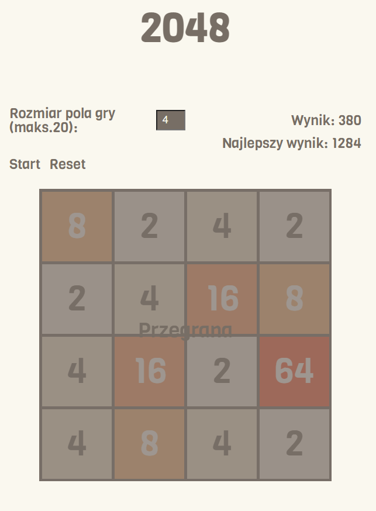
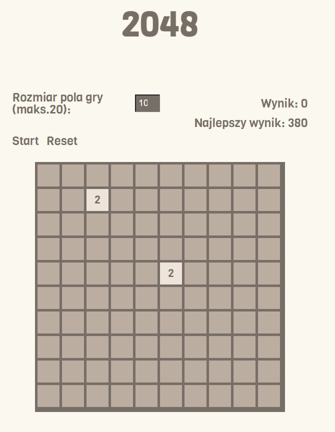

# Lab4

## gra.html

### W tym laboratorium pracowałem nad stworzeniem gry opartej na elementach canvas (komentarze w gra.js)
### Teraz przechodząc do zakładki 'Gra' możemy zobaczyć prostą grę '2048'
 
 

## Gra
### Celem gry 2048 jest takie przesuwanie i łączenie pojawiających się na planszy klocków, aby utworzyć klocek z liczbą 2048. 
### Rozgrywka 2048 odbywa się na planszy podzielonej na kratki o wybranym wymiarze (4×4, 5x5, 6x6 itd.).

 
 

### Najlepszą taktyką na tą grę jest wybranie jednego kąta w którym będziemy kierować komórki (czyli musimy zrezygnować z jednego klawisza strzałki np. w górę)
 

### Kiedy skończy się nam miejsce na planszy (ruch w żadną stronę nic nie zmieni) gra kończy się przegraną
 

### Jest możliwośc ułatwienia gry poprzez zwiększenie planszy np. do rozmiaru 10x10
 

### Możemy również zresetować grę poprzez naciśnięcie na reset.