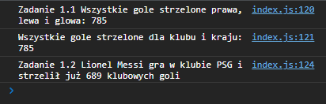
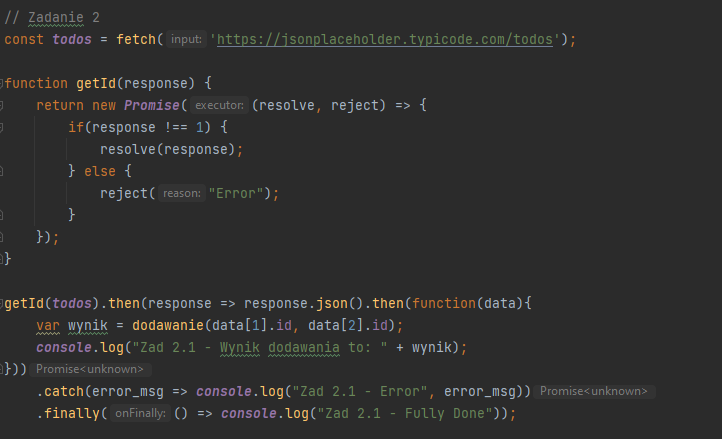

# Lab5

## "Asynchroniczny Javascript"

## Zadanie 1.1

### Tworzę obiekt JSON, zawierający w środku zagnieżdżone obiekty JSON z informacjami o piłkarzu Lionel Messi
 
 
 
## Zadanie 1.2
 
 
 
## Zadanie 2.1
### Od tego zadania wszystkie dane będą pobierane z [{JSON} Placeholder](https://jsonplaceholder.typicode.com/)
 
 
 
## Zadanie 2.2
 
 
 
## Zadanie 3
 
 
 
## Zadanie 4
 
 
 
## Zadanie 5
 
 
 
## Zadanie 6
 
 
 
