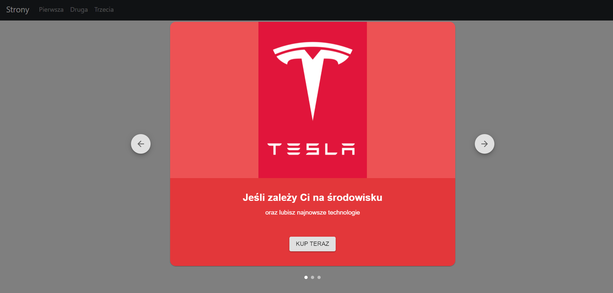

# Lab. nr 7 - "React - aplikacja nr 2"

## Stworzyłem 3 podstrony o różnej tematyce, każda zawierająca min.3 różne komponenty z biblioteki Material UI.
### Każdy komponent aplikacji (podstrona) ma swój własny routes
### Importujemy komponenty do użycia w routerze:

### Dodatkowo dodałem obsługe przypadku kiedy adres jest spoza tych zdefiniowanych:

#### Przykład takiej sytuacji: 


## Pierwsza podstrona - "Wybór marki auta":
#### Niepozornie wyglądająca aplikacja, która zawiera Carousel ze zdjeciami/logami mark samochodów.

```javascript
            <AutoRotatingCarousel
                label="Kup teraz"
                open={handleOpen.open}
                onClose={() => setHandleOpen({ open: false })}
                onStart={() => setHandleOpen({ open: false })}
                autoplay={false}
                mobile={isMobile}
                style={{ position: "absolute" }}
            >
                <Slide
                    media={
                        
                    }
                    mediaBackgroundStyle={{ backgroundColor: red[400] }}
                    style={{ backgroundColor: red[600] }}
                    title="Jeśli zależy Ci na środowisku"
                    subtitle="oraz lubisz najnowsze technologie, wybierz auto od Elona Muska!"
                />
                <Slide
                    media={
                        
                    }
                    mediaBackgroundStyle={{ backgroundColor: blue[400] }}
                    style={{ backgroundColor: blue[600] }}
                    title="Chcesz być popularny?"
                    subtitle="W dodatku nie wiesz co to kierunkowskazy? To idealne auta dla Ciebie!"
                />
                <Slide
                    media={
                        
                    }
                    mediaBackgroundStyle={{ backgroundColor: yellow[400] }}
                    style={{ backgroundColor: yellow[600] }}
                    title="Jeżeli lubisz samochody z pazurem"
                    subtitle="i nie myslisz o załozeniu rodziny to wybierz Lambo!"
                />
            </AutoRotatingCarousel>
```
#### Po wybraniu przycisku otrzymujemy dostęp do zmiany karty z logiem i opisem w carousel.

#### Po naciśnięciu strzałki w prawo:

#### Warto też zwrócić uwagę na dolnej częsci strony na świetną animacje zmiany karty z logiem:


## Wykorzystane komponenty Material-UI na tej podstronie:
<ul>
    <li>@material-ui/core/Button</li>
    <li>@material-ui/core/useMediaQuery</li>
    <li>@material-ui/core/colors</li>
    <li>material-auto-rotating-carousel</li>
</ul>

## Druga podstrona - "Ocena zamówienia z restauracji":

```javascript
        <div style={{
            display: "flex",
            justifyContent: "center",
            backgroundImage: "url('https://cdn.wallpapersafari.com/73/0/251fyQ.png')",
            height:'100vh',
            backgroundSize: 'cover',
            backgroundRepeat: 'no-repeat',
            alignItems: "center"
        }}>
            <Stack spacing={1} style={{
                width:'300px',
                backgroundImage: "url('https://www.designersguild.com/image/986/3939')",
                textAlign: "center",
                alignItems: "center"
            }}>
                <h1>Oceń zamówienie</h1>
                <Typography component="legend">Czas Dostawy</Typography>
                <Rating name="half-rating" defaultValue={5} precision={0.5} />
                <Typography component="legend">Smak</Typography>
                <Rating name="half-rating" defaultValue={5} precision={0.5} />
                <Typography component="legend">Jakość wykonania</Typography>
                <Rating name="half-rating" defaultValue={5} precision={0.5} />
                <Button>Wyślij ocenę</Button>
            </Stack>
        </div>
```
#### Do dyspozycji mamy 3 opcje oceny zamówienia poprzez rating gwiazdkowy(domyślnie wybrane 5 gwiazdek)

#### Na końcu możemy nacisnąć przycisk do wysłania oceny
## Wykorzystane komponenty Material-UI na tej podstronie:
<ul>
    <li>@material-ui/core/Button</li>
    <li>@mui/material/Stack</li>
    <li>@mui/material/Rating</li>
    <li>@mui/material/Typography</li>
</ul>

## Trzecia podstrona - "Karnet do klubu/siłowni":

#### Tutaj mamy pare modułów do omówienia, pierwszy to zdefiniowanie danych każdego karnetu
``` javascript
const rodzaj_karnetu = [
    {
        title: 'Karnet miesięczny',
        price: '149',
        description: [
        'Gwarancja stałej ceny karnetu',
        'Dostęp do klubu 24/7',
        'Woda na trening gratis',
        'Zajęcia grupowe w cenie',
        ],
        buttonVariant: 'outlined',
    },
    {
        title: 'Karnet na 6 miesięcy',
        subheader: 'Rekomendujemy',
        price: '76',
        description: [
        'Gwarancja stałej ceny karnetu',
        'Dostęp do klubu 24/7',
        'Woda na trening gratis',
        'Zajęcia grupowe w cenie',
        ],
        buttonVariant: 'contained',
    },
    {
        title: 'Karnet na 12 miesięcy',
        price: '45',
        description: [
        'Gwarancja stałej ceny karnetu',
        'Dostęp do klubu 24/7',
        'Woda na trening gratis',
        'Zajęcia grupowe w cenie',
        ],
        buttonVariant: 'outlined',
    },
];
```

#### Następnie tworzymy container odpowiedzialny za część górnn strony/nagłówkową (widoczna powyżej):
```javascript
            <Container disableGutters maxWidth="sm" component="main" sx={{ pt: 8, pb: 6 }}>
                <Typography
                    component="h1"
                    variant="h2"
                    align="center"
                    color="text.primary"
                    gutterBottom
                >
                    Kup Karnet
                </Typography>
                <Typography variant="h5" align="center" color="text.secondary" component="p">
                    Zacznij zmianę swojej sylwetki już dziś!
                </Typography>
                <Typography variant="h6" align="center" color="text.secondary" component="p">
                    Każdy rodzaj karnetu umozliwia dostęp do 240 obiektów w całej polsce.
                </Typography>
            </Container>
```
#### Tu też dane były wpisywane, natomiast w następnym kontenerze korzystamy z wcześniej utworzonych danych o karnetach:
```javascript
<Container maxWidth="md" component="main">
                <Grid container spacing={5} alignItems="flex-end">
                    {rodzaj_karnetu.map((tier) => (
                        <Grid
                            item
                            key={tier.title}
                            xs={12}
                            sm={tier.title === 'Karnet na 12 miesięcy' ? 12 : 6}
                            md={4}
                        >
                            <Card>
                                <CardHeader
                                    title={tier.title}
                                    subheader={tier.subheader}
                                    titleTypographyProps={{ align: 'center' }}
                                    subheaderTypographyProps={{
                                        align: 'center',
                                    }}
                                    sx={{
                                        backgroundColor: (theme) =>
                                            theme.palette.mode === 'light'
                                                ? theme.palette.grey[200]
                                                : theme.palette.grey[700],
                                    }}
                                />
                                <CardContent>
                                    <Box
                                        sx={{
                                            display: 'flex',
                                            justifyContent: 'center',
                                            alignItems: 'baseline',
                                            mb: 2,
                                        }}
                                    >
                                        <Typography component="h2" variant="h3" color="text.primary">
                                            {tier.price}zł
                                        </Typography>
                                        <Typography variant="h6" color="text.secondary">
                                            /msc
                                        </Typography>
                                    </Box>
                                    <ul>
                                        {tier.description.map((line) => (
                                            <Typography
                                                component="li"
                                                variant="subtitle1"
                                                align="center"
                                                key={line}
                                            >
                                                {line}
                                            </Typography>
                                        ))}
                                    </ul>
                                </CardContent>
                                <CardActions>
                                    <Button fullWidth variant={tier.buttonVariant}>
                                        Kup teraz
                                    </Button>
                                </CardActions>
                            </Card>
                        </Grid>
                    ))}
                </Grid>
            </Container>
```
#### Używamy Card i Grida do stworzenia prostych 3 'kartek' zawierającym informacje o danym karnecie

#### Korzystamy też z funkcji map() do generowania komponentów w CardContent oraz Boxów z Typography do danych w górnej częsci karty 
## Wykorzystane komponenty Material-UI na tej podstronie:
<ul>
    <li>@material-ui/core/Button</li>
    <li>@mui/material/Card</li>
    <li>@mui/material/CardActions</li>
    <li>@mui/material/CardContent</li>
    <li>@mui/material/CardHeader</li>
    <li>@mui/material/Typography</li>
    <li>@mui/material/Grid</li>
    <li>@mui/material/GlobalStyles</li>
</ul>
