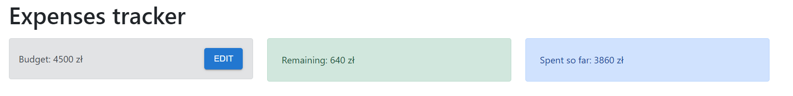

# Expenses tracker

### 'Kalkulator' finansowy stworzony na podstawie: https://github.com/chrisblakely01/react-budget-app
### Wykorzystane technologie:

<ul>
    <li>React</li>
    <li>Context API</li>
    <li>UUID</li>
    <li>Material-ui/icons</li>
    <li>Material-ui/material</li>
    <li>Material-ui/core</li>
</ul>

## Początkowy wygląd aplikacji


## Wygląd aplikacji po moich zmianach


## Dodane/zmienione elementy:

#### Dodanie kategorii do modelu wydatków, ale również zamiana divów na boxy do wyświetlania elementów Name, Category i Cost

```javascript
            <Box
				component="div"
				sx={{
					display: 'inline',
					p: 1,
					m: 1,
					bgcolor: (theme) => (theme.palette.mode === 'dark' ? '#101010' : '#fff'),
					color: (theme) =>
						theme.palette.mode === 'dark' ? 'grey.300' : 'grey.800',
					border: '1px solid',
					borderColor: (theme) =>
						theme.palette.mode === 'dark' ? 'grey.800' : 'grey.300',
					borderRadius: 2,
					fontSize: '0.875rem',
					fontWeight: '700',
					alignItems: 'center',
				}}
			>
				{props.category}
			</Box>
```
#### Opcje dostępne w dodawaniu wydatku


```javascript
                    <select
						required='required'
						type='text'
						class='form-control'
						id='category'
						value={category}
						onChange={(event) => setCategory(event.target.value)}
					>
						<option value="Holiday">Holiday</option>
						<option value="Investment">Investment</option>
						<option value="Transportation">Transportation</option>
						<option value="Food">Food</option>
						<option value="Medical & Healthcare">Medical & Healthcare</option>
						<option value="Personal Spending">Personal Spending</option>
					</select>
```


#### Zmiany widoczne w narzędziu git difftool


#### Ale również używająć difftoola w Pycharm'ie


#### Możliwość edycji budżetu

```javascript
const Budget = () => {
	const { budget, dispatch } = useContext(AppContext);
	const [isEditing, setIsEditing] = useState(false);

	const handleEditClick = () => {
		setIsEditing(true);
	};

	const handleSaveClick = (value) => {
		dispatch({
			type: 'SET_BUDGET',
			payload: value,
		});
		setIsEditing(false);
	};

	return (
		<div class='alert alert-secondary p-3 d-flex align-items-center justify-content-between'>
			{isEditing ? (
				<EditBudget handleSaveClick={handleSaveClick} budget={budget} />
			) : (
				<ViewBudget handleEditClick={handleEditClick} budget={budget} />
			)}
		</div>
	);
};
```
#### Zmiany widoczne na git difftool


#### Dodatkowo został użyty przycisk z @mui/material/Button do edycji oraz zapisu budżetu
```javascript
const EditBudget = (props) => {
	const [value, setValue] = useState(props.budget);
	return (
		<>
			<input
				required='required'
				type='number'
				class='form-control mr-3'
				id='name'
				value={value}
				onChange={(event) => setValue(event.target.value)}
			/>
			<Button onClick={() => props.handleSaveClick(value)} variant="contained" >Save</Button>
		</>
	);
};

export default EditBudget;
```

```javascript
const ViewBudget = (props) => {
	return (
		<>
			<span>Budget: {props.budget} zł</span>
			<Button onClick={props.handleEditClick} variant="contained" >Edit</Button>
		</>
	);
};
export default ViewBudget;
```

#### Dodanie możliwości usuwania danego wydatku i wykorzystanie ikony DeleteIcon (kosza) z material-ui


```javascript
<IconButton aria-label="delete">
    <DeleteIcon onClick={handleDeleteExpense} />
</IconButton>


const handleDeleteExpense = () => {
    dispatch({
        type: 'DELETE_EXPENSE',
        payload: props.id,
    });
};


case 'DELETE_EXPENSE':
return {
    ...state,
    expenses: state.expenses.filter(
        (expense) => expense.id !== action.payload
    ),
};
```

## Działanie aplikacji

#### Dodawanie wydatku

#### Po dodaniu wydatku z kategorii inwestycja


#### Budżet, gdy zabraknie nam środków


#### Po zwiększeniu budżetu


#### Wyszukiwanie wydatków po ich nazwie

